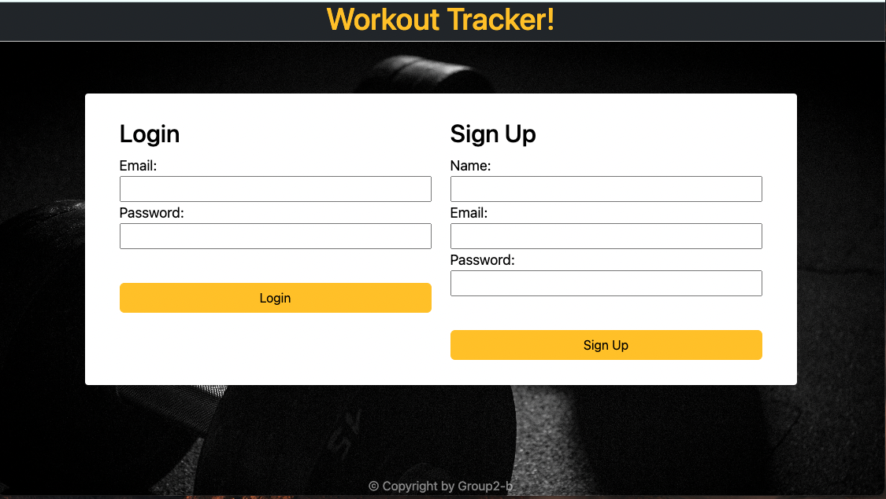
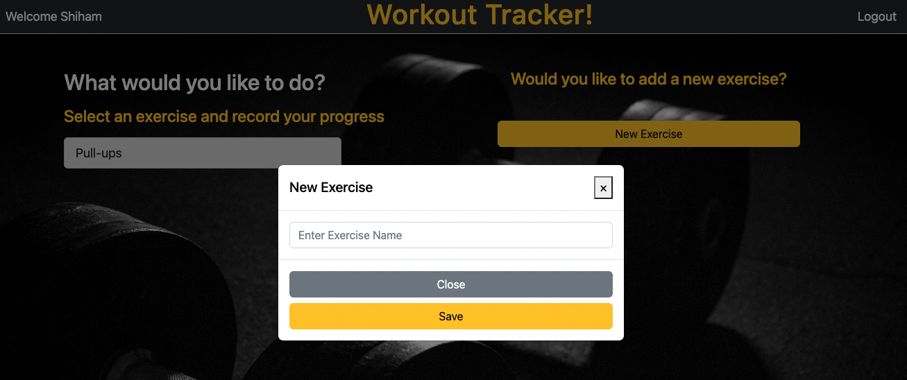
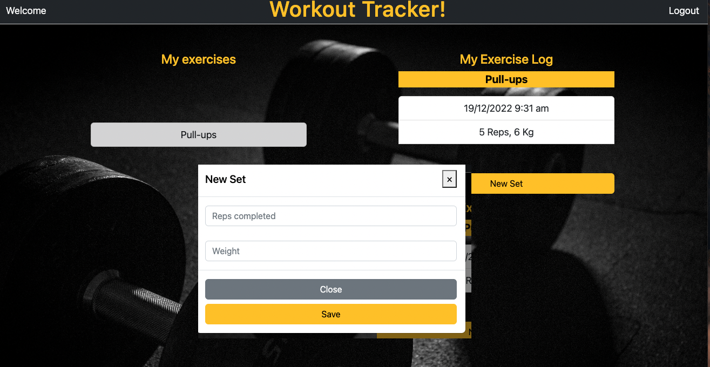

# Workout Tracker

## Description
The Workout Tracker helps you gain success in your fitness journey. 

It allows you to record your workouts at the gym, including the type of exercise and details of the exercise such as number of repititions(reps), weights and other details. The app saves your data securely to a database. You can login from any device to record and view your progress at the gym from any device. All you require is an internet connection and a web browser.

Deployed application link: [Workout-Tracker](https://ancient-eyrie-19788.herokuapp.com/)

## Table of Contents

- [User Story](#user-story)
- [Acceptance Criteria](#acceptance-criteria)
- [Technologies used](#technologies-used)
- [Installation](#installation)
- [Usage instructions](#usage-instructions)
- [Preview of the application](#preview-of-the-application)
- [Credits](#credits)

## User Story

```md
AS A fitness enjoyer/newcomer
I WANT to be able to track my exercises and workouts
SO THAT I can look back on previous workouts to see what I did and improve
```

## Acceptance Criteria

```md
WHEN I log into the website
THEN I am able to see all my previous exercises
WHEN I click create new exercise
THEN I am prompted with a modal with inputs and the new exercise is posted to the homepage
WHEN I click on a exercise
THEN I can see the previous sets and dates/times they were performed
WHEN I click on ‘New Set’
THEN I can add the reps and weight I performed and it is added along with the date an time it happened
```

## Technologies used
The following technologies have been used in the app: 
- Node.js
- HTML and CSS

The following npm packages have been used in the app:
 - bcrypt
 - dotenv
 - express
 - express-handlebar
 - mysql2
 - nodemailer (_new_ for sending welcome emails)
 - sequelize
 - serve-favicon (_new_ for caching the favourites icon)

## Installation
No installation required.

## Usage instructions
### First time user
1. Visit [Workout-Tracker](https://ancient-eyrie-19788.herokuapp.com/)
2. Enter your name, email address and password
3. Click on Sign up.
4. You will recieve a welcome email with your login details.

### Returning user
1. Visit [Workout-Tracker](https://ancient-eyrie-19788.herokuapp.com/)
2. Enter your email address and password
3. Click on Login.

### Functions
**Add Exercise** 
1. Login to the Workout Tracker homepage > Add Exercise > Add Exercise pop-up
2. Enter exercise name e.g. Bench Press
3. Click Save.

**Add set or create new log entry**
1. Select an exercise from the Workout Tracker homepage e.g. Bench Press
2. Select Add Set > Add Set pop-up
3. Enter reps and weight details
4. Click Save.

## Preview of the application

### Login and Signup


### Exercises, with Add Exercises


### Logs/Sets, with Add Sets


## Credits

Made by

- [Brodie Marshall](https://github.com/brodie02)
- [Shiham Jamaldeen](https://github.com/shiham-jamaldeen)
- [Dale Dulvesteyn](https://github.com/DaleDuiv)
